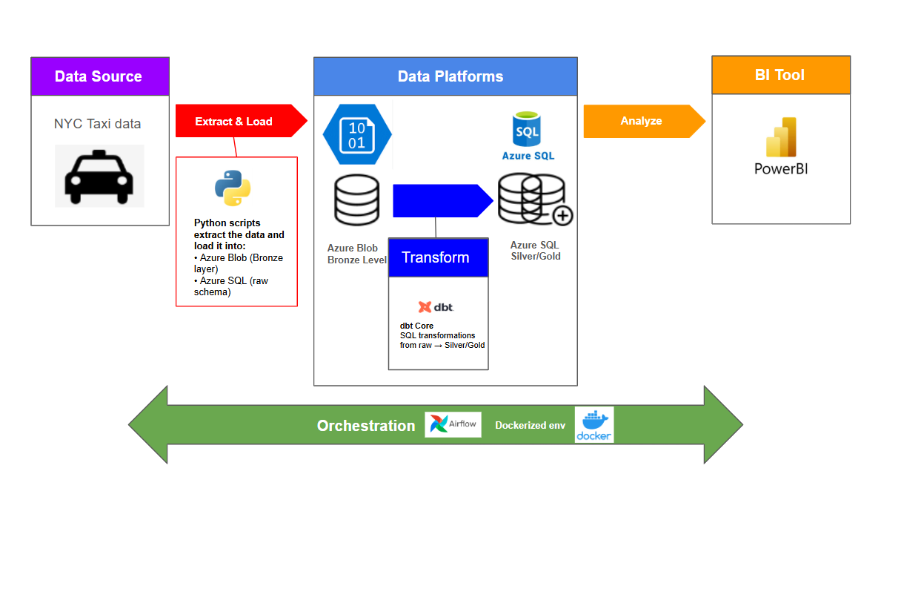
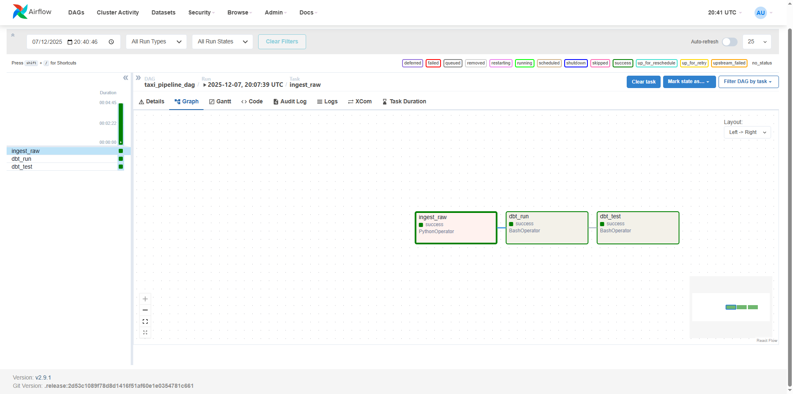
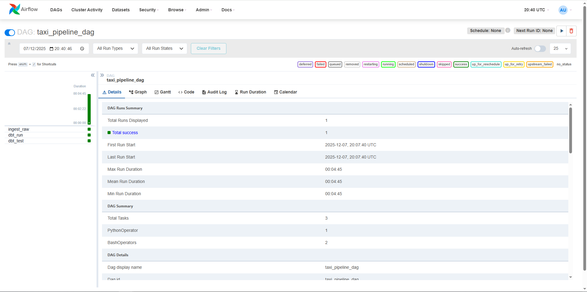
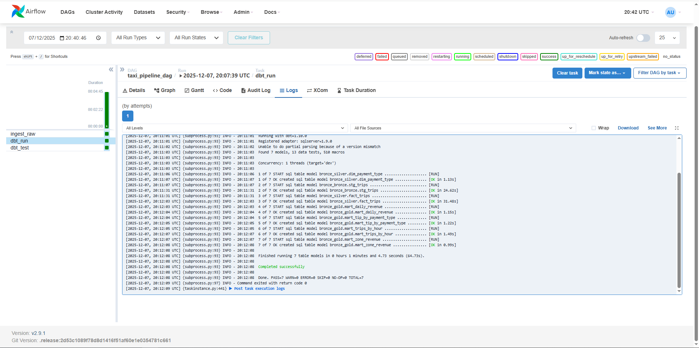
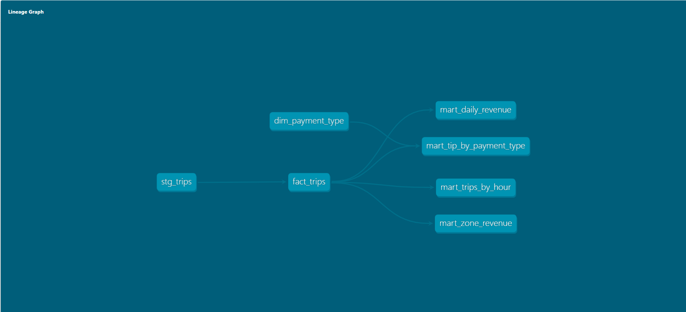
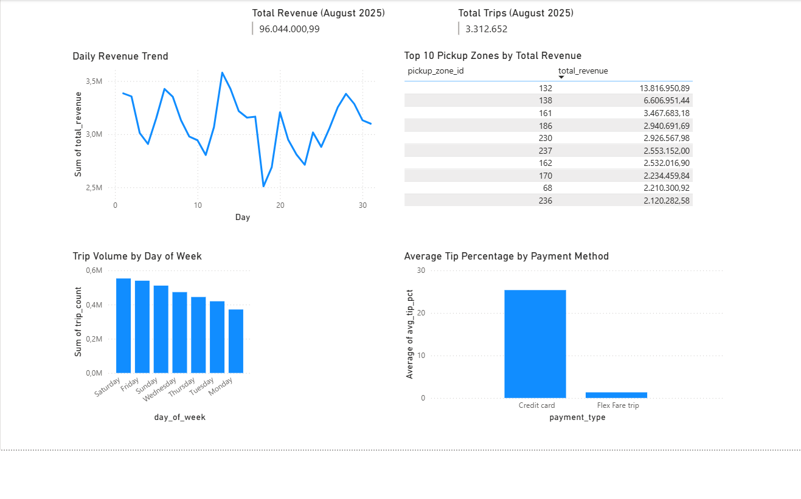

# 🚕 NYC Taxi Data Engineering Project  
### Modern Medallion Architecture | Docker • Airflow • dbt • Azure SQL • Power BI

---
## 🏗️ Architecture



## 📝 Project Overview

This end-to-end data engineering project implements a **modern Medallion Architecture (Bronze → Silver → Gold)** using:

- **Apache Airflow** for workflow orchestration  
- **dbt Core** for SQL-first transformations & data quality  
- **Docker** for a fully reproducible local environment  
- **Azure Storage + Azure SQL Database** as the cloud data layer  
- **Power BI** for business-ready dashboards  

The pipeline processes **NYC Yellow Taxi Trip Data for August 2025**, performing **ingestion → transformation → aggregation → visualization**.


---

## 🏆 Key Achievements

- ⚙️ **End-to-end pipeline** orchestrated via Airflow (ingest → dbt run → dbt test)  
- 🔗 **Fully modular Medallion Architecture** (raw → cleaned → analytics-ready marts)  
- 🧪 **Data Quality Framework** using dbt tests (unique, not null, accepted values, relationships)  
- 🐳 **Reproducible Development Environment** (single `docker compose up`)  
- ☁️ **Cloud integration with Azure SQL** for production-ready storage  
- 📊 **Power BI Dashboard** built directly from the Gold layer  
- 🚀 **Airflow DAG automation** with task dependencies. 

---


## 🧰 Tech Stack

- **Orchestration:** Apache Airflow (Dockerized)
- **Transformation:** dbt Core + SQL Server adapter
- **Storage:** Azure Blob Storage (Bronze), Azure SQL Database (Silver/Gold)
- **Containerization:** Docker Compose
- **Data Processing:** Python, pandas
- **Visualization:** Power BI
- **Version Control:** Git + GitHub

---

## 📂 Repository Structure
```
── airflow/
    ├── dags/
    │   └── taxi_pipeline_dag.py
    ├── dbt_profile/
    │   ├── .user.yml
    │   ├── profiles.yml       
    ├── dbt_project/
    │   ├── models/
    │   ├── target/
    │   ├── dbt_project.yml
    ├── docker-compose.yml
    ├── dockerfile
    ├── load_raw_to_sql.py
    ├── upload_to_blob.py
    ├── readme.md
    └── screenshots/
        ├── architecture.png
        ├── airflow_homepage.png
        ├── dag_dbt_run.png
        ├── dag_graph_view.png
        ├── dag_overview.png
        ├── dashboard.png
        ├── lineage_taxi.png

```

## 🔄 Data Pipeline Steps

### **1. Raw Ingestion (Bronze Layer)**
- `upload_to_blob.py` uploads the raw Parquet file into **Azure Blob Storage (Bronze layer)**.  
- `load_raw_to_sql.py`, executed by Airflow, reads data from Blob and loads it into **Azure SQL (`raw` schema)**.  
- **Airflow task:** `ingest_raw`

---

### **2. dbt Staging Layer (`stg_trips`)**
- Casts raw CSV/Parquet fields into proper SQL types (ints, decimals, datetimes).  
- Normalizes values (e.g. `store_and_fwd_flag`).  
- Filters out invalid records (negative distances/amounts, null timestamps, inconsistent pickup/dropoff times).  
- Provides a clean, typed base table for downstream models.  

**Airflow task:** `dbt_run`

---

### **3. dbt Silver Layer**
- Builds an analytics-friendly trips table from the staging layer.  
- Adds derived features: trip duration, pickup date/hour, weekday, tip percentage.  
- Uses small dimension tables (e.g. payment type descriptions) to normalize categorical fields.  

**Airflow task:** `dbt_run`

---

### **4. dbt Gold Layer**
Creates analytic marts:

- `mart_daily_revenue`
- `mart_trips_by_hour`
- `mart_zone_revenue`
- `mart_tip_by_payment_type`

These tables are consumed by **Power BI**.

---

### **5. Data Quality (dbt tests)**
- `unique` tests  
- `not_null` tests on critical fields (timestamps, amounts, keys).  
- `accepted_values` tests on categorical fields (rate codes, payment types).  
- Relationship tests between dimensions and facts . 

**Airflow task:** `dbt_test`

---

### **6. Power BI Dashboard**
- Connected directly to **Azure SQL Gold tables**  
- Used for reporting and visualization  

## 📸 Screenshots

### **Airflow DAG (Graph View)**


### **Airflow DAG Overview**


### **Airflow dbt Run Task**


### **dbt Lineage Graph**


### **Power BI Dashboard**


## 🎓 Key Learnings

- Designed and implemented a full **Medallion Architecture (Bronze → Silver → Gold)** on Azure.  
- Learned how to build and schedule a production-style pipeline using **Apache Airflow**.  
- Gained hands-on experience with **dbt Core**, creating modular SQL models, refactoring transformations, and maintaining lineage.  
- Applied **data quality frameworks** using dbt tests (`unique`, `not_null`, `relationships`, `accepted_values`).  
- Built a fully reproducible **Dockerized analytics engineering environment** using `docker compose`.  
- Understood how to integrate cloud storage and compute through **Azure Blob Storage** and **Azure SQL Database**.  
- Modeled clean **Gold layer marts** optimized for BI consumption.  
- Created a **Power BI dashboard** connected directly to Azure SQL, demonstrating the end-to-end value of the pipeline.  

